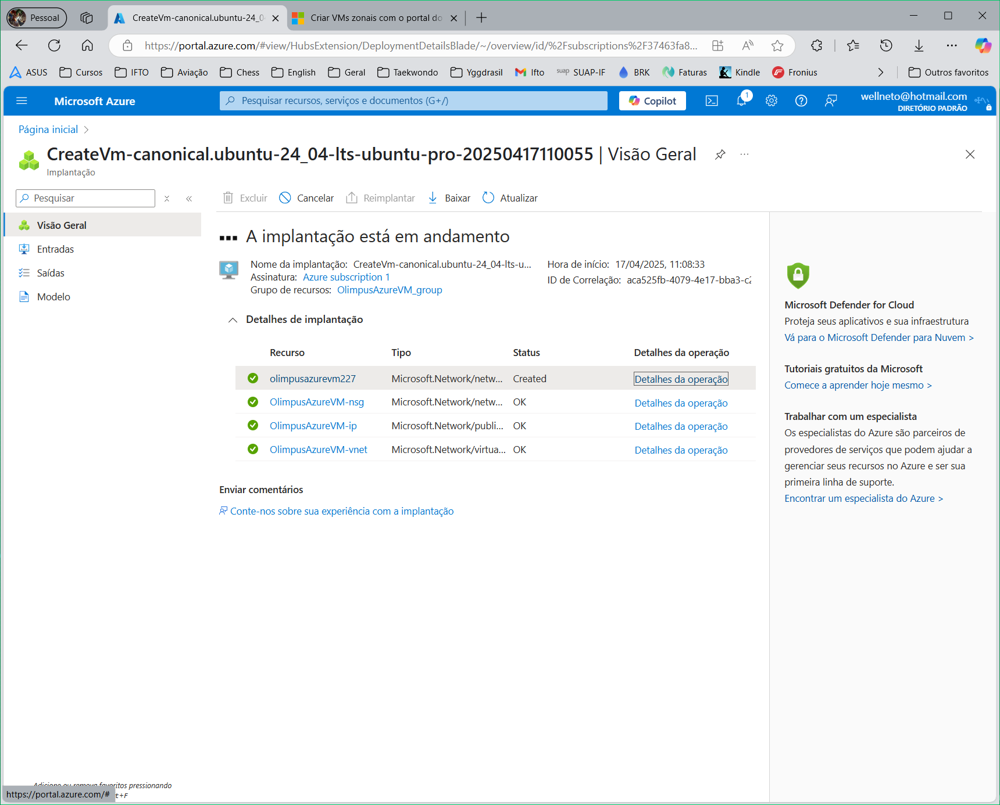
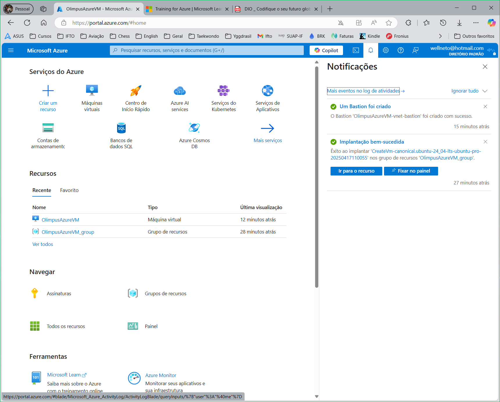
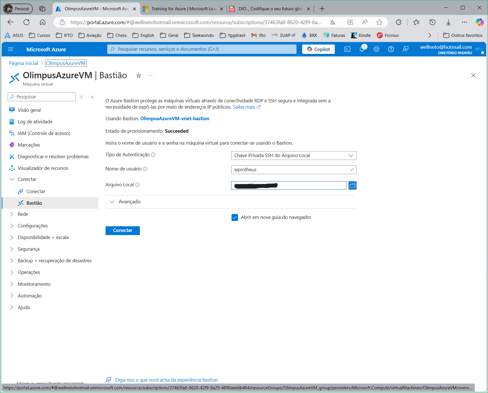

# DIO - Trilha Java Básico

## Autor

🔸[wprotheus](https://github.com/wprotheus)

---

## Desafio - Criando máquinas Virtuais na Azure  

Atividade executada conforme orientações abaixo, retiradas do [Descrição do Desafio](https://web.dio.me/lab/beneficios-da-nuvem-laboratorio/learning/6a23ad75-e88b-4fc0-a291-6d4006cd7239)  
<small><sup>Obs.: O link acima somente é acessado através de uma conta na plataforma DIO.</sup></small>  

### Descrição do Desafio  

> Este laboratório tem como objetivo **praticar o processo de criação e configuração de uma máquina virtual na plataforma Microsoft Azure.** Como entregável, o desafio proposto é a criação de um **repositório contendo resumos, anotações e dicas sobre o uso da Azure**, servindo como material de apoio para estudos e futuras implementações.

### Objetivos de Aprendizagem  

> **Ao concluir este desafio, você será capaz de:**

> - Aplicar os conceitos aprendidos em um ambiente prático;
> - Documentar processos técnicos de forma clara e estruturada;
> - Utilizar o GitHub como ferramenta para compartilhamento de documentação técnica.

### Entrega do Desafio
> **Para concluir este desafio, você deverá:**

> 1. **Assistir a todas as vídeo-aulas**  
> Não pule nenhuma etapa! As aulas contêm informações essenciais para o sucesso do seu projeto.

> 2. **Criar um repositório público no GitHub contendo:**  
> Um arquivo ```README.md``` detalhado  
> Quaisquer arquivos adicionais que sejam relevantes para documentar sua experiência  
> Opcionalmente, capturas de tela relevantes organizadas em uma pasta ```/images```  

> 3. **Enviar o link do seu repositório** e uma breve descrição clicando no botão “Entregar Projeto”

---  

# Microsoft Azure
### Material de Apoio para Estudos e Implementações

## ✨ Visão Geral do Microsoft Azure

### O que é Azure?
Microsoft Azure é uma plataforma de computação em nuvem que oferece serviços para construir, implantar e gerenciar aplicativos através de uma rede global de data centers da Microsoft.

### Benefícios Principais
- **Escalabilidade:** Capacidade de aumentar ou diminuir recursos conforme demanda.
- **Flexibilidade:** Suporte a múltiplas linguagens, ferramentas e estruturas.
- **Integração:** Oferece integração com serviços Microsoft e outras plataformas.

## 📄 Principais Serviços e Recursos

### Azure Virtual Machines
- Máquinas virtuais escaláveis e flexíveis com suporte a várias distribuições de sistemas operacionais.

### Azure App Service
- Hospedagem de aplicativos web, móveis, API com facilidade de escalabilidade automática.

### Azure Blob Storage
- Armazenamento de objetos para grande quantidade de dados, ideal para backups, mídias e arquivos.

### Azure SQL Database
- Banco de dados relacional como serviço com opções de recuperação e segurança avançadas.

### Azure Functions
- Serviço serverless para executar código em resposta a eventos sem gerenciamento de infraestrutura.

## 🚀 Implementações Práticas

### Segurança
- Utilize Azure Security Center para monitorar e melhorar a postura de segurança de suas implementações.

### Integração Contínua e Entrega Contínua (CI/CD)
- Configure pipelines com Azure DevOps para automatizar a construção, teste e implantação de aplicativos.

### Monitoramento e Diagnóstico
- Use Azure Monitor para monitorar a saúde de seus serviços e obter insights operacionais.

## 📅 Dicas de Estudo
- **Documentação Oficial:** A Microsoft oferece documentação detalhada e guias práticos para cada serviço do Azure.
- **Certificações Azure:** AZ-900 (Fundamentals), AZ-204 (Developer Associate).
- **Laboratórios práticos:** Disponíveis no Azure Portal.

---

# 🚀 Tutorial Prático — Criação de Máquina Virtual no Microsoft Azure

## 🎯 Objetivo
Criar uma VM Linux ou Windows no Azure, acessá-la via SSH/RDP e entender configurações básicas de rede e segurança.

## ✅ Requisitos
- Conta ativa no [Azure Portal](https://portal.azure.com)
- Acesso ao navegador
- Cliente SSH (Linux/Mac) ou RDP (Windows)

## ✨ Passo a Passo

### 1. Acesse o Azure Portal
- Navegue até: **Máquinas Virtuais > Criar > Máquina Virtual**

### 2. Guia "Básico"
- **Assinatura / Grupo de Recursos**
- **Nome da VM:** `vm-estudo-azure`
- **Região:** `West US`
- **Imagem:** `Ubuntu / Windows Server`
- **Tamanho:** `B1s para testes`
- **Usuário admin:** `Criar um usuário`
- **Autenticação:** `SSH - RSA`
- **Portas:** `22 (Linux) - 3389 (Windows)`

### 3. Guia "Discos"
- SSD Padrão ou HDD para testes

### 4. Guia "Rede"
- VNet e IP Público automático
- NSG: `porta 22 (Linux) - 3389 (Windows)`

### 5. Guia "Gerenciamento"
- Monitoramento: `padrão`
- Auto-shutdown: `padrão`

### 6. "Revisar + Criar"
- Validar e clicar -> **Criar**

## 🔌 Acesso à VM

### Linux
```bash
ssh usuario@IP_DA_VM
```

### Windows
- Use o cliente RDP (mstsc)
- IP público + credenciais

## 🧐 Anotações Importantes

| Tema              | Dica |
|------------------|------|
| Custos           | Pare a VM quando não estiver usando |
| Segurança        | Restrinja o NSG para seu IP pessoal |
| Snapshots        | Tire antes de atualizações importantes |
| Escalabilidade   | Pode redimensionar a VM após criada |
| Tags             | Organize recursos por tags |

---

## 📷 Capturas de telas

### Visão geral da VM:  
  
  
### VM criada com sucesso:  
  
  
### Conexão via Bastião:  
  
  
### Tela inicial terminal Ubuntu  
  

---

#### Documentação Oficial
- [Início Rápido: Criar uma máquina virtual do Windows no Portal do Azure](https://learn.microsoft.com/pt-br/azure/virtual-machines/windows/quick-create-portal) - Artigo no Microsoft Learning
